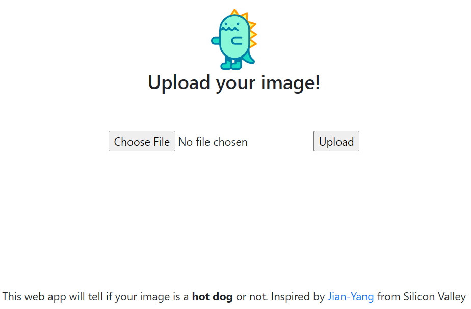
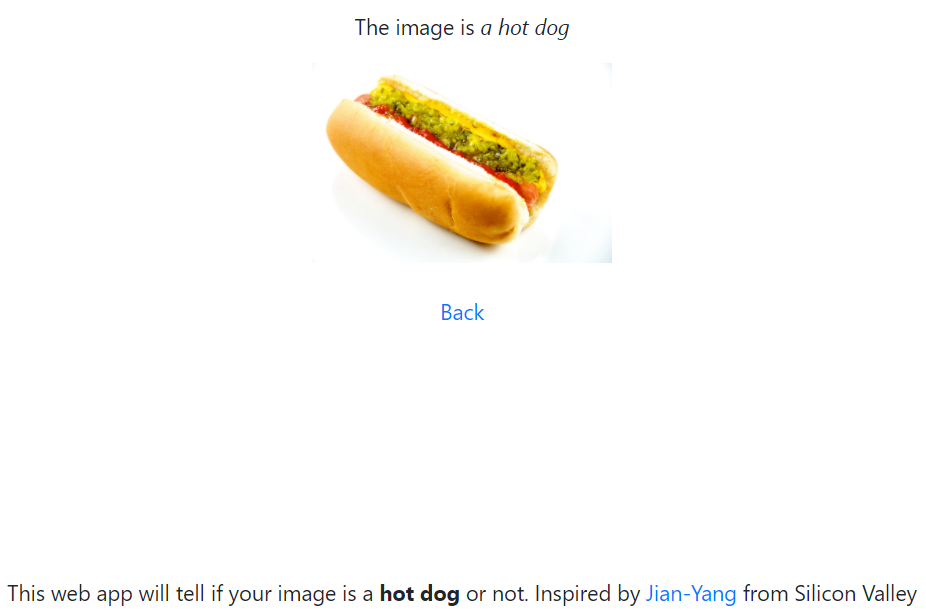

[![Pull][pr]][pr-url]
[![Issues][issues]][issues-url]
[![Size][repo]][repo-url]
[![Last][last]][last-url]
[![Release][release]][release-url]
[![License][license]][license-url]
[![LinkedIn][linkedin-shield]][linkedin-url]
![github-shield]

 

  
  <h3 align="center">Hot dog or not</h3>
  

    Welcome to this GitHub repository!
     
    <a href="https://github.com/shridpant/hungryish"><strong>Explore the docs »</strong></a>
     
    <a href="https://github.com/shridpant/hungryish/issues">Report Bug</a>
    ·
    <a href="https://github.com/shridpant/hungryish/issues">Request Feature</a>
  

<!-- TABLE OF CONTENTS -->
## Table of Contents

* [About the Project](#about-the-project)
    * [Technologies](#technologies)
    * [Execution](#execution)
    * [Illustration](#illustration)
* [License](#license)
* [Contributing](#contributing)
* [Contact](#contact)
* [Acknowledgements](#acknowledgements)

<!-- ABOUT THE PROJECT -->
## About The Project

    

This repository contains the source code for the `hungryish` web app- it will tell if your image has a *hot dog* or *not*! The inspiration for the project was <a href="https://www.hbo.com/silicon-valley" target="_blank">Jian-Yang from the popular HBO Series Silicon Valley</a>. This project was made possible by many open-sourced libraries and frameworks.

<!-- TECHNOLOGIES -->
### Technologies

`Hungryish` was built written in Python 3.7 employing Flask and Tensorflow. The front-end is simply HTML and CSS. See `Acknowledgements` for more info.

<!-- EXECUTION -->
### Execution

To execute, simply:
  1. Clone this repository with `git clone https://github.com/shridpant/hungryish`. 
  2. Navigate to the root folder of the project and execute `pip install -r requirements.txt` to install all dependencies.
  3. Execute with `python app.py`.
  4. Open the address from the terminal on your browser. Upload the image and get your results!

<!-- ILLUSTRATION -->
### Illustration

1. Home 

2. Hot dog

3. Not a hot dog

<!-- LICENSE -->
## License

`Hungryish` is distributed under the MIT license. See [LICENSE](https://github.com/shridpant/hungryish/blob/master/LICENSE) for more information.

<!-- CONTRIBUTING -->
## Contributing

This project welcomes contributions and suggestions. Feel free to fork this repository or submit your ideas through [issues](https://github.com/shridpant/hungryish/issues). Please carefully read and follow the [Contributor Covenant Code of Conduct](https://github.com/shridpant/stockie/blob/main/CODE_OF_CONDUCT.md) while participating in this project.

<!-- CONTACT -->
## Contact

Do reach out to me on [LinkedIn](https://www.linkedin.com/in/shridpant/) for any queries regarding the project.

<!-- ACKNOWLEDGEMENTS -->
## Acknowledements

Hungryish wouldn't be possible without the following resources:

* [SeeFood Technologies](https://www.seefoodtechnologies.com/nothotdog/)
* [Freepik from www.flaticon.com](https://www.flaticon.com/authors/freepik)     
* [Jupyter Notebook](https://jupyter.org/)
* [Tensorflow](https://github.com/tensorflow/tensorflow)
* [Flask](https://flask.palletsprojects.com/en/1.1.x/)
* [josephlee94](https://github.com/josephlee94/intuitive-deep-learning)
* [VPanjeta](https://github.com/VPanjeta/hotdog-or-not-hotdog)
* [Bootstrap](https://getbootstrap.com/)
* [Img Shields](https://shields.io)

<!-- MARKDOWN LINKS & IMAGES -->
[pr]: https://img.shields.io/github/issues-pr/shridpant/hungryish
[pr-url]: https://github.com/shridpant/hungryish/pulls
[repo]: https://img.shields.io/github/repo-size/shridpant/hungryish
[repo-url]: https://github.com/shridpant/hungryish
[last]: https://img.shields.io/github/last-commit/shridpant/hungryish
[last-url]: https://github.com/shridpant/hungryish/commits/main
[contributors]: https://img.shields.io/github/contributors/shridpant/hungryish
[contributors-url]: https://github.com/shridpant/hungryish/graphs/contributors
[release]: https://img.shields.io/github/v/release/shridpant/hungryish?include_prereleases
[release-url]: https://github.com/shridpant/hungryish/releases/tag/alpha
[issues]: https://img.shields.io/github/issues-raw/shridpant/hungryish
[issues-url]: https://github.com/shridpant/hungryish/issues
[license]: https://img.shields.io/apm/l/vim-mode
[license-url]: https://github.com/shridpant/hungryish/blob/master/LICENSE
[linkedin-shield]: https://github.com/shridpant/stockie/blob/main/static/readme/linkedin.svg
[linkedin-url]: https://www.linkedin.com/in/shridpant/
[github-shield]: https://img.shields.io/github/followers/shridpant?style=social
